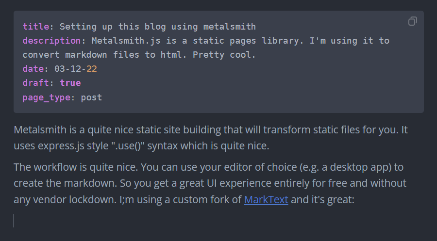

<span class="info">**Info:** Moved blog to hugo. See [this](/posts/moving-blog-hugo) post.</span>

<span class="update">**Update 08/12/22:** I should say I can't recommend this though unless you specifically want the customizability that metalsmith may offer. You're probably better off using Jekyll with github pages and choosing a nice theme.</span>


Metalsmith is a static site building libary that will transform static files for you. It uses express.js style ".use()" syntax which is quite nice.

The workflow is rather smooth. You can use your editor of choice (e.g. a desktop app) to create the markdown which gives a great UI experience entirely for free and without any vendor lockdown. ~~I'm using a custom fork of [MarkText](https://github.com/bn-l/marktext) and it's great~~ **(Update: I recommend Typora which I found after this. Similar but a lot better)**:



The lighter colored block of code is "front matter" a markdown extension for file metadata. Here I'm using it for the post metadata. Metalsmith takes this and injects it into the templates which is very cool. 

I made a few changes to the metalsmith default dev environment so that when templates (here pug) or scss is modified, metalsmith will rebuild and the dev server will hot reload the changes (no need to press refresh on the browser).  This is the way I modified my npm scripts in package.json:

```json
    "scripts": {
        "start": "cross-env NODE_ENV=development NODE_PATH=./node_modules npm run watch & npm run serve",
        "build": "cross-env NODE_ENV=production node metalsmith.js",
        "watch": "cross-env NODE_ENV=development nodemon metalsmith.js",
        "serve": "live-server --wait=200 ./docs/",
        "start:debug": "cross-env NODE_ENV=development DEBUG=* node metalsmith && serve -l 5000 dist"
    },
    "nodemonConfig": {
        "watch": [
            "src"
        ],
        "ext": "js scss pug json html md"
    },
```

That's it. :thumbsup:

Next post: Setting up github pages with a custom domain.

But first: [Part 2](/posts/setting-up-this-blog-using-metalsmith-part-2)

::: update
Update 08/12/22: I should say I can't recommend this though unless you specifically want the customizability that metalsmith may offer. You're probably better off [using Jekyll with github pages](https://www.markdownguide.org/tools/github-pages/) and choosing a nice theme. 
:::

[Link to Part 2](/posts/setting-up-this-blog-using-metalsmith-part-2)