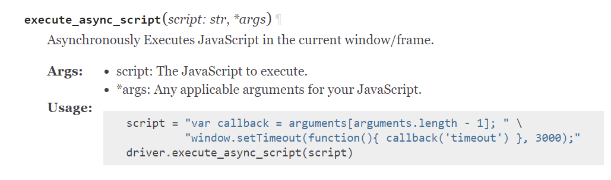

**Summary**: A global is given to the running js script called "arguments". It's an array and its last item is a function that when called returns its first argument to python and ends the async script

WebDriver: A standard way of controlling browsers remotely. Created by the w3c a web standards non-profit. See: https://www.w3.org/TR/webdriver2/

Various browsers implement these standards to create an API for selenium to operate its "driver" class.

The problem is that selenium's documentation expects you have read the webdriver [standard](https://www.w3.org/TR/webdriver2/). And, wow, you may not have. 

**So when you see this:**

**And wonder what is going on,** you are not alone. To expland this documentation:

- the `*args` parameter is a comma separated set of values you can pass to the js script. These are wrapped up into a tuple and then converted into a list. In js the script will access them through a global called `arguments` as an array. 
- **THIS IS IMPORTANT:** The last argument added to the array is the resolve function that let's selenium know when the async function has ended. And it will pass the returned value back to selenium.

