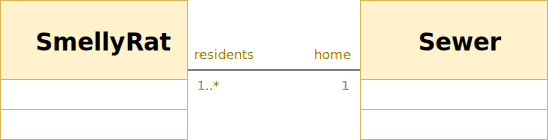
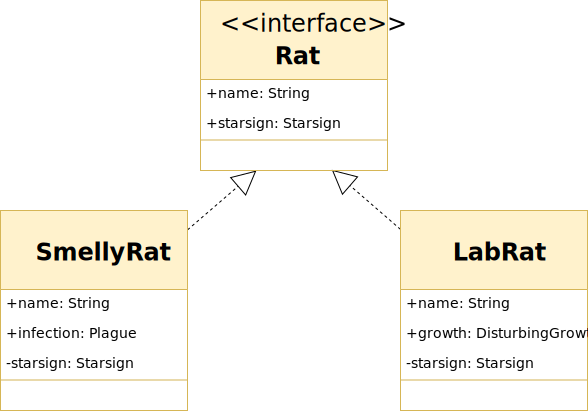
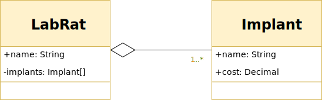
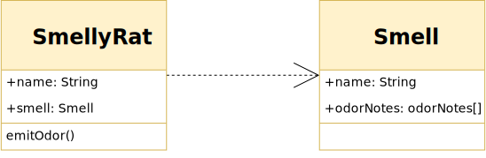

**Purpose**: Planing object orientated programs by showing object relationships

## Relationships 

### Inheritance:

**Each SmellyRat is an instance of an Animal.** A SmellyRat will have the usual things Animals have (like a heart, brain) but a SmellyRat adds its own character: Smell, indefinable ratness, fur.

### Association

#### Bidirectional:

**Both classes have a association with each other.** The opposite end of the connection describes the relationship with *roles*: SmellyRat is a *resident*, Sewer is a *home*, and *multiplicity*: There are potentially *1* to many \* SmellyRats residing a Sewer, and just 1 Sewer is *home* for to a SmellyRat.

#### Uni-directional:

**Only one class needs to know about the other.** A Plague does not reference a SmellyRat specifically in its implementation but the SmellyRat's public Infection is a Plague type (sounds serious).

### Interface:

**SmellyRat and LabRat are implementations of a Rat.**

### Aggregation:

**An implant is a <u>part</u> of a LabRat but is not necessarily destroyed when the LabRat is**. Another example: A Car with 4 Wheels. The Wheels are *parts* of the car but can live outside it independently.

### Composition:

**A StrangeGrowth cannot exist without a LabRat.** Like the aggregation, a LabRat can have many StrangeGrowth parts but if the LabRat parent goes so do the StrangeGrowth instances (poor Rat).

### Dependency:

**SmellyRat depends on the API of Smell**. To emitOdor a SmellyRat accesses the properties of a Smell. If Smell changes, SmellyRat might have to also.

<mark>These diagrams may be used with permission. Feel free to contact.</mark>

## References

https://developer.ibm.com/articles/the-class-diagram/

https://en.wikipedia.org/wiki/Class_diagram

