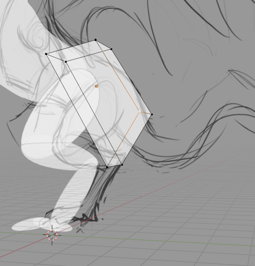
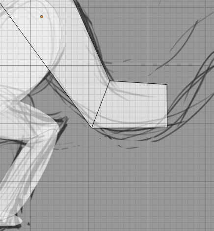
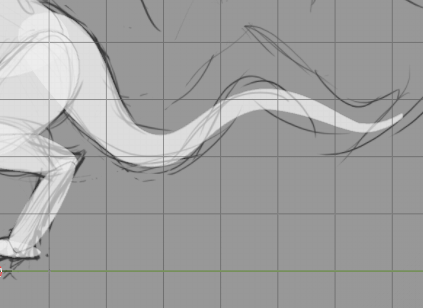
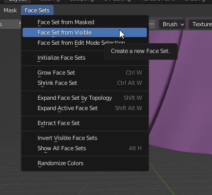
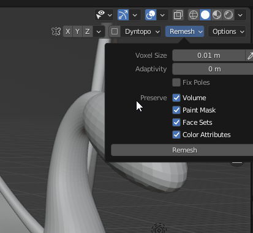

## Intro 

Blender has various manipulation "modes". For example, in "Object Mode" you manipulate the object as a whole—moving it around, rotating it, scaling it. "Edit Mode" is for more fine work where you can adjust individual edges, vertices, etc.

This tutorial will cover sculpting, not how to make hard surface things like a robot or a weapon (although it will help you with that).

### Terms

- **Vertex**: A single point in 3D space
- **Edge**: A line connecting two points (if you have a cube, this line looks more like an "edge")
- **Mesh**: A 3D object. Literally a "mesh" of vertices in space with "edges" (lines) between them that form squares or triangles
- **Topology**: The way a mesh's vertices and edges are structured. How edges flow around certain areas
- **Transform**: A description of the manipulations that have been done to a mesh (e.g.: "move left 2 units, up 1 and then scale 200%")

### Quick Hotkeys

- Object mode:
    - **Shift-a**: add a basic shape
    - The location (**g**) and rotation (**r**) keys can be used with **x, y, z** and then numbers to quickly transform a mesh
    - **Tab**: toggle edit mode
    - **I**: Add keyframe
- Edit mode:
    - **1, 2, 3**: Change the select mode to 1: vertices, 2: edges, 3: faces.
- Universal:
    - **Ctrl-I**: invert selection
    - **Numpad**: change view quickly
    - **Ctrl-tab**: mode selection pop up wheel  

### Tip

- The **origin** (little orange dot) of a mesh affects many things. E.g.: mirroring and rotation. Select > right-click on the mesh(s) in object mode to change / reset the origin.

### Useful modifiers

Change shape and form in a way that can be toggled on and off.

- Mirroring: Takes an object and copies it around the origin. Good for symmetry. Model half of something (a leg or arm) then just mirror it.
- Subdivision Surface: "Sub-divides" a mesh's surfaces (see below)

## Blocking out

A good starting point. Fitting basic shapes to be vaguely similar to a sketch or reference image

 

I am making a dragon here. Using the same technique I used for the rest of the body, I am going to "block out" the tail:

- Make sure viewport shading is selected with these options (in the dropdown): Lighting: Flat, Color: Material, Options: X-Ray (0.5), Outline: checked.
- Create a cube, rotate and scale it, and match it roughly up to the size and location of the tail using front view etc. It should be overlapping.
- Add a subdivision surface modifier to round it out a bit

- In edit mode, extrude and then manipulate edges to fill out the tail roughly

- The end result. The subdivision surface modifier is doing most of the work here to make it look good.

- Snapping:

- The wing of the dragon at this stage is simply a plane with edges extruded. Here I grabbed a vertex (circled) and it auto snapped to the center of the "wing bone".

## Remeshing

- Blocking out is finished and all the cubes are rounded with a Subdivision Surface modifier.
- Next select the entire model and:
    - Right click > Convert To > Mesh
    - Right click again > Join
- With the mesh still selected press Ctrl-tab > **sculpt mode**.

- Change the [face sets](https://docs.blender.org/manual/en/latest/sculpt_paint/sculpting/editing/face_sets.html). Face Sets > Face Set from Visible

- Remesh button: Found near the top right in sculpt mode. Under the hood this will encase the entire mesh in voxels (like a pixel except a cube) and where the mesh and a voxel collide it will "remesh". A lower voxels size will mean greater fidelity (just like smaller pixels) but will increase the number of faces in the resulting mesh and affect performance.

- Test if it worked by holding shift and painting on the model. This should smooth it out. If it's too rough remesh again and lower the voxel size.
- Then work in stages of detail:
    - Stage 1: Not focusing on small brush strokes but the overall shape. Use the grab brush (**G**) and sparingly the snake hook (**K**) here to massage the mesh on a more structural level.
    - Stage 2: Remesh after stage 1. Maybe to a lower voxel size. Draw brush (**X**). Anti draw brush (hold **Ctrl**). Clay strips. Smooth. Remesh (if needed).
    - Stage 3: The crease brush is great for creases in skin. The anti draw sharp brush and smooth work well together. Warning: remeshing here can ruin fine detail (but [dynotopo](https://docs.blender.org/manual/en/latest/sculpt_paint/sculpting/tool_settings/dyntopo.html) can help with that).

## Final Tip

If you're not creating game models you can stop here. If you are, and performance is an issue, then you need to "retopologize" your mesh: go from high poly to low poly. [This](https://www.youtube.com/watch?v=X2GNyEUvpD4) is a great video on this using modern techniques. Part 2 of this tutorial covers this and "texture baking".

[Link to Part 2](/posts/beginner-blender-tutorial-sculpture-part-2)

